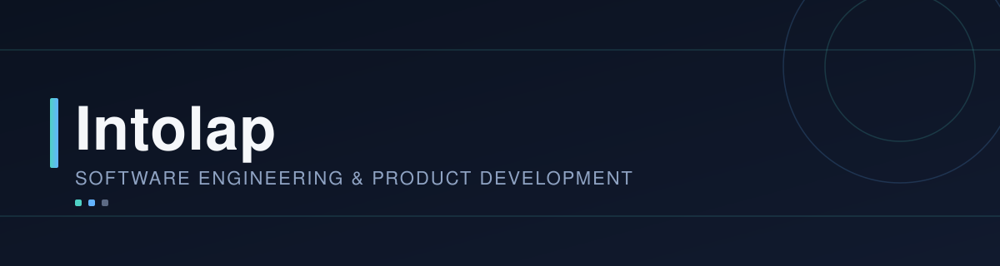
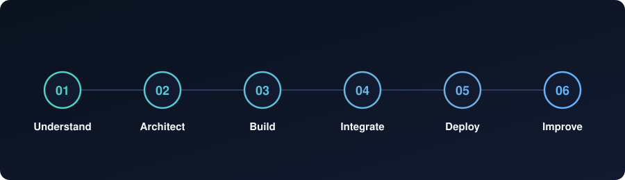
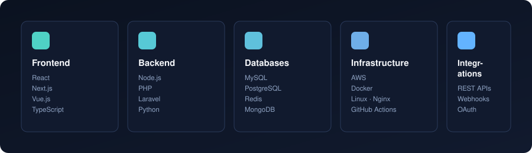
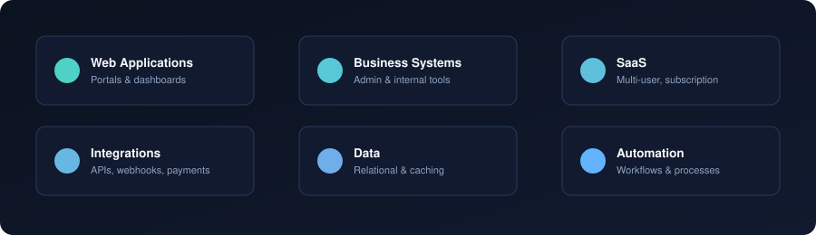
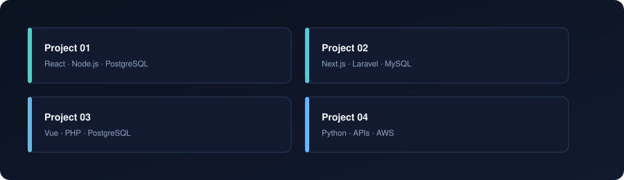

<p align="center">
  
</p>

<h1 align="center">Software engineering for products that matter.</h1>

<p align="center">
  We design, build, integrate and maintain web applications, SaaS platforms,
  business systems and custom software.
</p>

<p align="center">
  <a href="https://intolaptech.com">Website</a>
  ·
  <a href="https://github.com/intolap">GitHub</a>
  ·
  <a href="mailto:hello@intolaptech.com">Contact</a>
</p>

---

## What we do

We help businesses turn ideas, processes and existing systems into
reliable software.

<table>
<tr>
<td width="33%" align="center">

### 🧩 Product Development

From an initial idea to a production-ready application.

**SaaS · Web Apps · Portals · Dashboards**

</td>

<td width="33%" align="center">

### ⚙️ Business Software

Software that supports the way a business actually works.

**Platforms · Admin Systems · Internal Tools · Workflows**

</td>

<td width="33%" align="center">

### 🔌 Integrations

Connecting applications, services and data into one system.

**APIs · Webhooks · Payments · Third-party Services**

</td>
</tr>

<tr>
<td width="33%" align="center">

### 🚀 Modernization

Improving existing software without throwing everything away.

**Legacy Systems · Refactoring · Migration · Performance**

</td>

<td width="33%" align="center">

### ☁️ Cloud & Infrastructure

Taking applications from development to reliable production.

**Cloud · Docker · CI/CD · Deployment · Monitoring**

</td>

<td width="33%" align="center">

### 🛠️ Long-term Engineering

Software needs care after launch.

**Maintenance · Optimization · New Features · Support**

</td>
</tr>
</table>

---

# From problem to production

We don't start with a framework.

We start by understanding **what needs to be solved**.

<p align="center">
  
</p>

### 01 — Understand

We understand the business, users, existing systems and constraints.

### 02 — Architect

We define the technical approach, system boundaries, data model and integrations.

### 03 — Build

We develop the product in small, maintainable and testable pieces.

### 04 — Integrate

We connect APIs, external services, payments, data sources and business workflows.

### 05 — Deploy

We take the application into production with appropriate infrastructure and
deployment processes.

### 06 — Improve

We continuously improve performance, reliability, usability and functionality.

---

# Technology

We work across the stack rather than being tied to a single framework.

<p align="center">
  
</p>

### Frontend

`React` · `Next.js` · `Vue.js` · `TypeScript` · `JavaScript`

### Backend

`Node.js` · `PHP` · `Laravel` · `Python`

### Databases

`MySQL` · `PostgreSQL` · `Redis` · `MongoDB`

### Infrastructure

`AWS` · `Docker` · `Linux` · `Nginx` · `GitHub Actions`

### Integrations

`REST APIs` · `Webhooks` · `OAuth` · `Payment Gateways` · `Third-party APIs`

> Our stack is a means to an end. We choose technologies based on the
> problem, existing ecosystem and long-term requirements.

---

# Engineering experience

<p align="center">
  
</p>

We have experience working across different kinds of software systems:

| Area | Examples |
|---|---|
| 🌐 Web applications | Customer-facing applications, portals and dashboards |
| 🏢 Business systems | Admin platforms, operational software and internal tools |
| ☁️ SaaS | Multi-user and subscription-based applications |
| 🔗 Integrations | APIs, webhooks, payment and third-party services |
| 🗄️ Data | Relational databases, caching and data-driven applications |
| 🔄 Automation | Business workflows and system-to-system processes |
| 🧱 Existing systems | Refactoring, modernization and feature development |

---

# How we think about software

### Keep it understandable.

Complexity is sometimes necessary.

Unnecessary complexity isn't.

### Build for change.

Requirements change. Businesses change. Products change.

Good architecture makes those changes possible without rebuilding everything.

### Solve the actual problem.

We don't introduce technology simply because it is new.

We choose what makes sense for the product.

### Own the entire system.

Frontend, backend, database, integrations and infrastructure
are parts of the same product.

We look at the system as a whole.

---

# Selected work

<p align="center">
  
</p>

<table>
<tr>
<td width="50%">

### Project / Product 01

Short description of the product and the problem it solves.

**Stack:** React · Node.js · PostgreSQL

[View project →](#)

</td>

<td width="50%">

### Project / Product 02

Short description of the product and the problem it solves.

**Stack:** Next.js · Laravel · MySQL

[View project →](#)

</td>
</tr>

<tr>
<td width="50%">

### Project / Product 03

Short description of the product and the problem it solves.

**Stack:** Vue · PHP · PostgreSQL

[View project →](#)

</td>

<td width="50%">

### Project / Product 04

Short description of the product and the problem it solves.

**Stack:** Python · APIs · AWS

[View project →](#)

</td>
</tr>
</table>

---

# Built for the real world

Software rarely exists in isolation.

It has to work with:

```text
                     ┌───────────────────┐
                     │     BUSINESS      │
                     └─────────┬─────────┘
                               │
                               ▼
                    ┌─────────────────────┐
                    │      PRODUCT        │
                    └──────────┬──────────┘
                               │
             ┌─────────────────┼─────────────────┐
             │                 │                 │
             ▼                 ▼                 ▼
        ┌─────────┐       ┌─────────┐       ┌─────────┐
        │Frontend │       │ Backend │       │  Data   │
        └────┬────┘       └────┬────┘       └────┬────┘
             │                 │                 │
             └─────────────────┼─────────────────┘
                               │
                               ▼
                       ┌──────────────┐
                       │ Integrations │
                       └──────┬───────┘
                              │
                              ▼
                       ┌──────────────┐
                       │    Cloud     │
                       └──────────────┘
```

---

<p align="center">
  © Intolap Tech · <a href="https://intolaptech.com">intolaptech.com</a>
</p>
